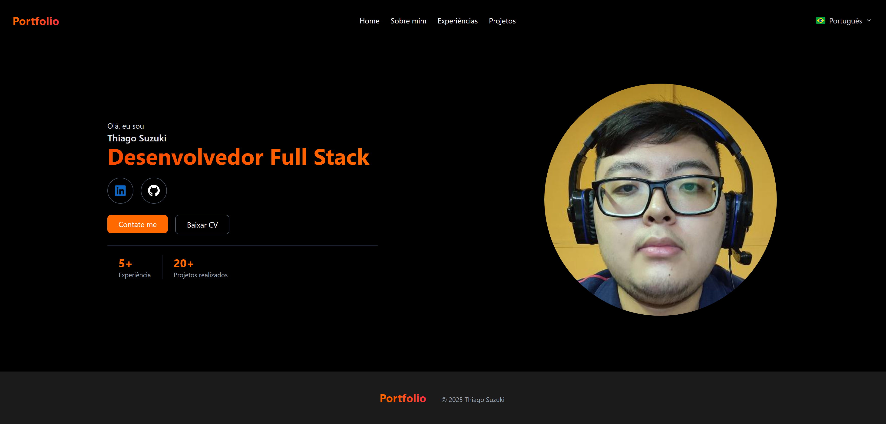

## Portfolio
Portfoilo pessoal para mostrar um pouco das minhas experiências e projetos

<h1 align="center">
  
</h1>

<br /><br />

## 🚀 Tecnologias
- [TypeScript](https://www.typescriptlang.org/) > Linguagem Principal da Aplicação
- [NextJS](https://nextjs.org/) > Framework com React para criação do Layout 
- [TailwindCSS](https://tailwindcss.com/) > Extensão para o NextJS para estilização das páginas
- [Shadcn](https://ui-v4.shadcn.com/) > Biblioteca de Componentes para o NextJS
- [React Icons](https://www.react-icons.com/) > Biblioteca de ícones
- [Next Intl](https://next-intl.dev/) > Biblioteca para tradução de textos
- [Motion](https://motion.dev/) > Biblioteca para Animação


<br /><br />

## 💻 Executando o Projeto


#### 1º Passo - Configure as Ferramentas necessárias para rodar o projeto:

- [Node.js](https://nodejs.org/en/) (Versão 22)


#### 2º Passo - Instale as Dependências:

```bash
$ npm install
```

#### 3º Passo - Rode o projeto:

```bash
# development
$ npm run dev
```

<br /><br />

## Link do Deploy
https://thiago-suzuki.vercel.app/